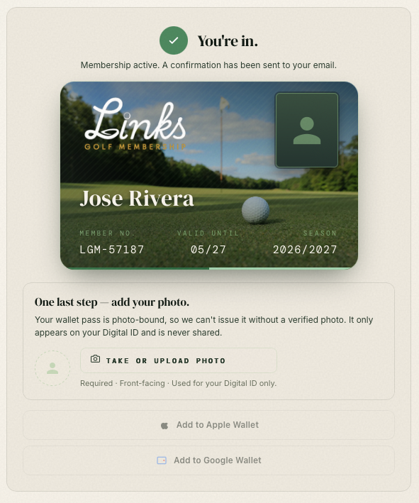

# Engineering backlog

Tracked follow-ups for **ops, product, and UX**; items below mix **open work** with **recently implemented** bullets (with file links) so the file stays the single inventory alongside [`BATCHES.md`](BATCHES.md).

**Roadmap grouping (batches A–D, what’s done vs open):** see [`BATCHES.md`](BATCHES.md).

---

## Resend / member OTP (updated)

### Implemented in code

- **Member dashboard (`member.me`)** — [`trpc.member.me`](../server/routers.ts) loads the signed-in member from Supabase via [`fetchMemberProfileForSession`](../server/memberProfileFromDb.ts) (same **`SUPABASE_SERVICE_ROLE_KEY`** requirement as welcome). [`Dashboard`](../client/src/pages/Dashboard.tsx) uses `member.session` + `member.me`; shows retry UI if profile is unavailable. [`Login`](../client/src/pages/Login.tsx) invalidates `member.me` after OTP success.
- **OTP storage** — [`server/otpStore.ts`](../server/otpStore.ts): uses **`REDIS_URL`** with `SETEX` when set; otherwise a **process-wide in-memory `Map`** with 10-minute TTL (fixes the old per-request `Map` bug). Vitest forces in-memory store (`VITEST` / `NODE_ENV=test`).
- **sendOtp rate limits** — [`server/sendOtpRateLimit.ts`](../server/sendOtpRateLimit.ts): fixed-window counters **per email** and **per client IP** before calling Resend; uses **`REDIS_URL`** when set (same client as OTP store), otherwise an in-process `Map`. Defaults: **15 min** window, **4** sends/email/window, **20** sends/IP/window. Override with **`SEND_OTP_RATE_WINDOW_MS`**, **`SEND_OTP_MAX_PER_EMAIL_PER_WINDOW`**, **`SEND_OTP_MAX_PER_IP_PER_WINDOW`**. Client IP from `x-forwarded-for` (first hop) then Express `req.ip` / socket ([`getRequestClientIp`](../server/sendOtpRateLimit.ts)).
- **Server-side verify** — [`server/routers.ts`](../server/routers.ts) `member.verifyOtp` calls `verifyAndConsumeOtp` (one-time use).
- **Login flow** — [`client/src/pages/Login.tsx`](../client/src/pages/Login.tsx) calls `trpc.member.verifyOtp` with **email + OTP only**; the server resolves `members.id` from the verified email. No `login_otp` in localStorage.
- **Member session** — After OTP success, server sets httpOnly cookie `links_member_session` with a **signed JWT** ([`server/memberJwt.ts`](../server/memberJwt.ts)); [`trpc.member.session`](../server/routers.ts) / [`member.logout`](../server/routers.ts); client gates via [`useHasMemberSession`](../client/src/hooks/useHasMemberSession.ts) and [`Dashboard`](../client/src/pages/Dashboard.tsx). [`MEMBER_SESSION_COOKIE`](../shared/const.ts) in shared const.
- **Welcome email (once per address)** — [`server/welcomeEmailOnce.ts`](../server/welcomeEmailOnce.ts): Redis key `links:welcome:sent:{email}` or in-memory `Set` after Resend succeeds. **Additionally**, when the service role loads the member row, [`fetchMemberWelcomeFields`](../server/memberWelcomeFromDb.ts) reads **`welcome_email_sent_at`**; if set, welcome is skipped. After a successful send, [`markWelcomeEmailSentAtMember`](../server/memberWelcomeFromDb.ts) updates that column. **Production Supabase:** migration [`001_members_welcome_email_sent_at.sql`](../references/migrations/supabase/001_members_welcome_email_sent_at.sql) is applied. Other environments should run the same SQL; until then, the server retries a select without that column and relies on Redis/memory only for that leg.

### Still operational / follow-up

1. **`RESEND_API_KEY`** — Must be set in each deployed environment or emails return `false` / skip. Documented in [`references/ENVIRONMENT.md`](./ENVIRONMENT.md).
2. **`REDIS_URL`** — Set in **production** when running **more than one Node instance** or horizontal scale; otherwise in-memory fallback is single-process only. **Welcome-once** also benefits from Redis in multi-instance setups (otherwise each process has its own `Set`). See [`references/ENVIRONMENT.md`](./ENVIRONMENT.md).
3. **`MEMBER_JWT_SECRET`** — Required in **production** (at least 32 characters). Signs the member session JWT; dev/test uses an in-code fallback only when `NODE_ENV` is not `production`. See [`references/ENVIRONMENT.md`](./ENVIRONMENT.md).
4. **`SUPABASE_SERVICE_ROLE_KEY`** (plus `SUPABASE_URL` or `VITE_SUPABASE_URL`) — Optional for OTP alone; **required** for welcome-from-DB, `welcome_email_sent_at`, and **`member.me`** / dashboard profile loads.
5. **E2E** — Manual or automated flow: OTP path, httpOnly cookie + `member.session`, **`member.me`** / dashboard load, real Resend inbox, Redis in staging, multi-replica check.
6. **Renewal / lifecycle emails (later)** — e.g. “Renews in X days” — not implemented; will need renewal dates in data + scheduler or Resend batch when product is ready.
7. **Stricter OTP verify (no client-supplied `memberId`)** — **Done:** [`member.verifyOtp`](../server/routers.ts) consumes the OTP, then [`resolveMemberIdFromEmail`](../server/memberWelcomeFromDb.ts) loads `members.id` with the service role; the session JWT `sub` is that id only. [`Login`](../client/src/pages/Login.tsx) does not send `memberId`. Vitest: [`server/member.verifyOtp.test.ts`](../server/member.verifyOtp.test.ts).
8. **Reverse proxy / client IP** — **`TRUST_PROXY`:** set `1`, `true`, or a positive hop count so Express [`trust proxy`](https://expressjs.com/en/guide/behind-proxies.html) is enabled in [`server/_core/index.ts`](../server/_core/index.ts). IP-based OTP rate limits still read the first `x-forwarded-for` hop in [`getRequestClientIp`](../server/sendOtpRateLimit.ts); validate your proxy strips/forges headers appropriately. See [`references/ENVIRONMENT.md`](./ENVIRONMENT.md).
9. **OTP rate-limit tuning (optional)** — Defaults are in [`sendOtpRateLimit.ts`](../server/sendOtpRateLimit.ts); override with **`SEND_OTP_RATE_WINDOW_MS`**, **`SEND_OTP_MAX_PER_EMAIL_PER_WINDOW`**, **`SEND_OTP_MAX_PER_IP_PER_WINDOW`** per environment once you have abuse telemetry.

---

## Courses map & partner UI

_Scope: primarily the Home **02 · Our Network** experience in [`CoursesSection`](../client/src/components/CoursesSection.tsx) (map + filters); overlap with [`Courses.tsx`](../client/src/pages/Courses.tsx) where noted._

### Implemented in code (recent)

- **Map hover** — Hover `InfoWindow` removed; pins use a native **`title`** tooltip (no blank header / close “X”). Details on **click** use the panel below the map ([`CoursesMap`](../client/src/components/CoursesMap.tsx)).
- **Click / info panel** — Larger type (Cormorant title, base body), `max-w-lg`, clear close control (`X` icon), tier + discount at readable sizes.
- **Pins** — Slightly larger default / selected circle scales.
- **“View full course directory”** — Link is **`md:hidden`** in [`CoursesSection`](../client/src/components/CoursesSection.tsx) (mobile only).
- **Decorative arrows** — Removed from hero, courses CTA, login, directory CTA, and i18n copy; **kept** on pricing checkout (**Continue to payment** / pay) in [`PricingSection`](../client/src/components/PricingSection.tsx).

### Still open

1. **Map pins** — Custom pin art / brand glyph beyond the current circle tweak.
2. **Map click cards** — Further breakpoint QA if needed.
3. **Rich hover on map** — Optional custom overlay if product wants a styled hover card without `InfoWindow` chrome.

---

## Internationalization (optional)

1. **`partnerCourses` localized display names** — **Done:** stable `slug` on [`partnerCourses`](../client/src/data/partnerCourses.ts) and coordinates; [`partnerCourseName`](../client/src/lib/partnerCourseName.ts) + Spanish keys `courses.partner.{slug}` in [`LanguageContext`](../client/src/contexts/LanguageContext.tsx); used on Home [`CoursesSection`](../client/src/components/CoursesSection.tsx), [`CoursesMap`](../client/src/components/CoursesMap.tsx), and directory [`Courses.tsx`](../client/src/pages/Courses.tsx).

---

## Marketing & conversion (Batch D — beyond map)

_General polish after auth/data paths are stable; complements **Courses map & partner UI** above._

1. **Section shell / layout rhythm** — **Done:** shared utility [`.marketing-section-inner`](../client/src/index.css) (`container` + `py-20 md:py-28` + stacking context) on Benefits, How it works, Pricing, FAQ; courses body uses matching bottom padding (`pb-20 md:pb-28`).
2. **Mobile course UX (broader)** — A dedicated pass on **02 · Our Network** small-screen layout and touch targets beyond the map-specific bullets (filters, list/grid, map chrome).
3. **Featured row / social proof** — Trust strip near pricing: testimonials, partner logos row, press quotes, or similar to support conversion.

---

## Sign-up flow & member card

_Reference UI — post-payment **“You’re in”** confirmation: digital member card, **photo upload** step, and wallet buttons (disabled until photo)._

### Implemented in code (recent)

- **Photo after payment (mock checkout)** — [`PricingSection`](../client/src/components/PricingSection.tsx): details without photo → payment step → success + **DigitalMemberCard**, photo upload, then wallet CTAs enabled after save. Supabase: `updateMemberPhotoUrl`, `memberId` as UUID string, `activateMembership` on step 3.
- **Shared member card** — [`DigitalMemberCard`](../client/src/components/DigitalMemberCard.tsx) + [`memberCardDisplay`](../client/src/lib/memberCardDisplay.ts): used on Home pricing success, [`Dashboard`](../client/src/pages/Dashboard.tsx), and [`HowItWorksSection`](../client/src/components/HowItWorksSection.tsx).

### Still open

1. **Real Stripe payment** — Replace mock “pay” step with Stripe Checkout or Elements; keep the same post-payment photo + wallet gating.
2. **Tab close between payment and photo** — Recovery path (email deep link, dashboard banner, or resume token) if the user leaves before uploading.
3. **Member card polish** — Optional: “Links Golf Membership” wordmark line, **randomized aerial** subset ([Unsplash golf collection](https://unsplash.com/collections/bJnL-rJ3zAM/golf)) per member with attribution, closer pixel-match to `./images/membership-youre-in-post-payment-reference.png`.
4. **Wallet button icons** — Replace placeholder wallet CTAs with **brand-compliant** Apple / Google wallet SVG marks (monochrome variants that meet minimum size rules).

---

_Add new sections below as other backlog themes appear._
